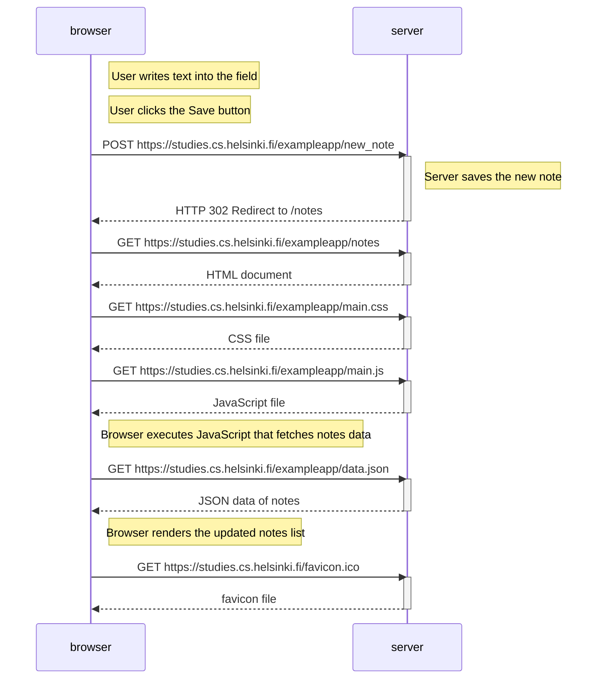

```mermaid
sequenceDiagram
participant browser
participant server

    Note right of browser: User writes text into the field
    Note right of browser: User clicks the Save button

    browser->>server: POST https://studies.cs.helsinki.fi/exampleapp/new_note
    activate server
    Note right of server: Server saves the new note
    server-->>browser: HTTP 302 Redirect to /notes
    deactivate server

    browser->>server: GET https://studies.cs.helsinki.fi/exampleapp/notes
    activate server
    server-->>browser: HTML document
    deactivate server

    browser->>server: GET https://studies.cs.helsinki.fi/exampleapp/main.css
    activate server
    server-->>browser: CSS file
    deactivate server

    browser->>server: GET https://studies.cs.helsinki.fi/exampleapp/main.js
    activate server
    server-->>browser: JavaScript file
    deactivate server

    Note right of browser: Browser executes JavaScript that fetches notes data

    browser->>server: GET https://studies.cs.helsinki.fi/exampleapp/data.json
    activate server
    server-->>browser: JSON data of notes
    deactivate server

    Note right of browser: Browser renders the updated notes list

    browser->>server: GET https://studies.cs.helsinki.fi/favicon.ico
    activate server
    server-->>browser: favicon file
    deactivate server
```
